# main2.py - Comprehensive Attribution Pipeline Documentation

## Overview

`main2.py` is the primary production script for the Marketing Attribution Pipeline. It processes customer journey data from BigQuery, applies multiple attribution models, and generates comprehensive business intelligence outputs. The script handles **3 conversion types** (Subscription, Trial, Registration) across **3 lookback windows** (30, 60, 90 days), producing **45 unique attribution perspectives**.

## System Architecture

### BigQuery Data Pipeline Flow

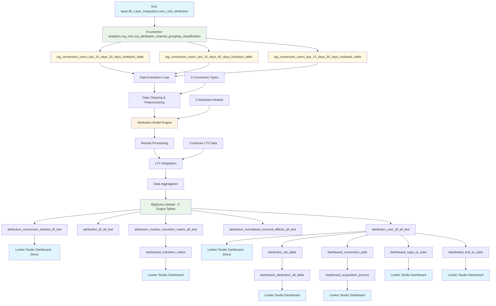

### Output Tables & Dashboard Integration

**5 BigQuery Output Tables:**

1. **`attribution_conversion_window_df_test`** → **Direct to Looker Studio**
   - Contains median conversion time analysis by conversion type
   - Direct connection to attribution dashboard

2. **`attribution_df_all_test`** → **Not directly connected**
   - Channel-level attribution scores across all models
   - Used for internal analysis and aggregations

3. **`attribution_markov_transition_matrix_all_test`** → **Via View to Looker Studio**
   - Raw Markov chain transition probabilities
   - Connected through `dashboard_transition_matrix` view (processes aggregated touchpoints)
   - Final connection to attribution dashboard

4. **`attribution_normalized_removal_effects_all_test`** → **Not directly connected**
   - Channel removal effect analysis
   - Used for internal channel performance evaluation

5. **`attribution_user_df_all_test`** → **Multiple Connections to Looker Studio**
   - **Direct connection** to attribution dashboard
   - **Via `attribution_set_table`** → `dashboard_attribution_all_table` view → dashboard
   - **Via `dashboard_conversion_path`** → `dashboard_acquisition_journey` view → dashboard
   - **Via `dashboard_regis_to_subs`** view → dashboard
   - **Via `dashboard_trial_to_subs`** view → dashboard

**Dashboard Architecture:**
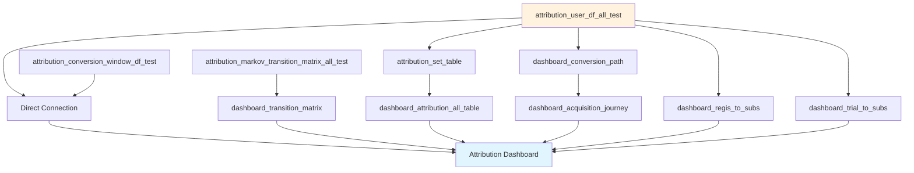

### Data Source Architecture

**1. Source BigQuery Table (Daily Refresh)**
- **Table**: `ft-bi-team.BI_Layer_Integration.conv_visit_attribution`
- **Owner**: BI Engineering Team
- **Refresh**: Daily
- **Purpose**: Primary customer journey and conversion data

**2. Channel Grouping Classification View**
- **View**: `ft-customer-analytics.crg_nniu.crg_attribution_channel_grouping_classification`
- **Source**: Takes `conv_visit_attribution` table
- **Purpose**: Applies channel grouping classification logic
- **Processing**: Channel standardization and categorization

**3. Staging Views (15-Day Rolling Window)**
- **30-Day Lookback**: `stg_conversion_users_last_15_days_30_days_lookback_table`
- **60-Day Lookback**: `stg_conversion_users_last_15_days_60_days_lookback_table` 
- **90-Day Lookback**: `stg_conversion_users_last_15_days_90_days_lookback_table`
- **Window Logic**: Uses `CURRENT_DATE() - 15` to capture 15 days of daily data
- **Lookback**: 30/60/90 days refers to attribution window length for each user journey

**4. Processing Flow**
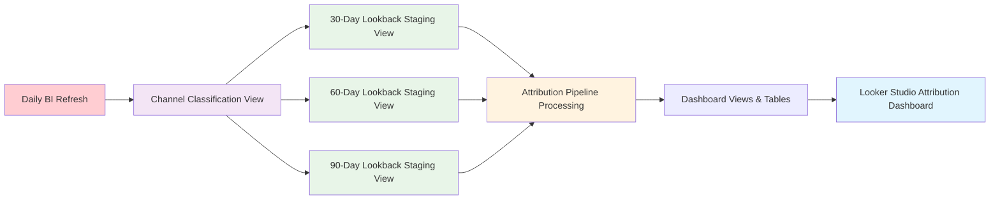

## Data Flow Architecture

### Phase 1: Data Extraction & Preparation

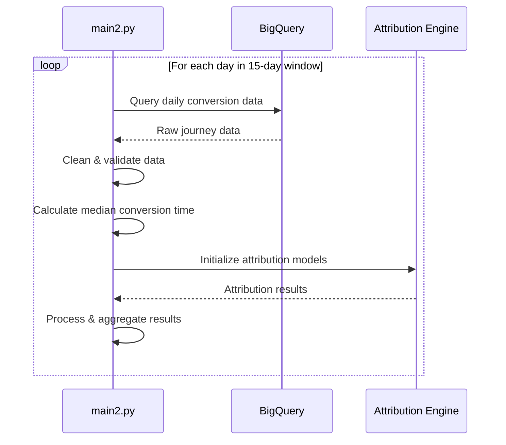

### Phase 2: Multi-Dimensional Processing

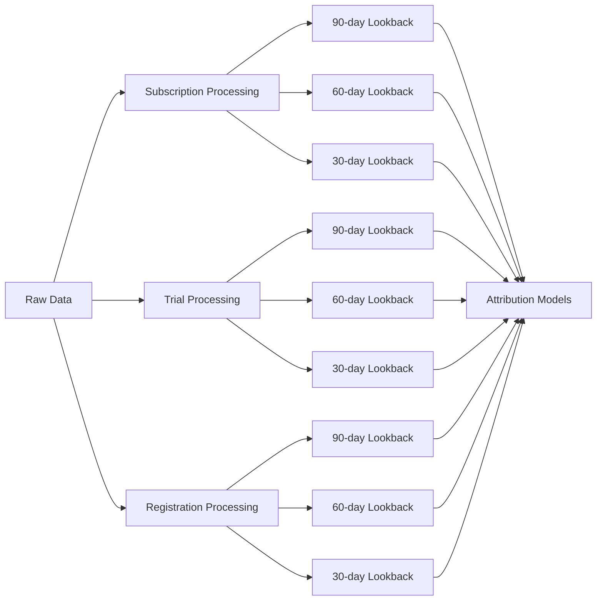

## Core Components

### 1. Configuration & Initialization

**Location**: Lines 24-54

```python
# Core configuration parameters
project = "ft-customer-analytics"                    # GCP project
location = "EU"                                      # BigQuery location
client = bigquery.Client(project=project, location=location)

# Data mapping configuration
ids = "user_guid"                                    # User identifier column
date = "attribution_visit_start_time"                # Timestamp column
touchpoint = "touchpoint"                           # Marketing channel column
transaction = "converting_visit"                    # Conversion flag column

# Processing window (15-day rolling)
end_date = pd.Timestamp.today().date() - pd.DateOffset(days=1)
start_date = end_date - pd.DateOffset(days=14)
```

**Key Features:**
- **Dynamic Date Range**: Automatically processes last 15 days
- **EU Data Residency**: Ensures GDPR compliance
- **Configurable Mapping**: Easily adaptable to different data schemas

### 2. Data Extraction Engine

**Location**: Lines 57-73 (repeated for each conversion type/window)

```python
for current_date in pd.date_range(start_date, end_date, freq="D"):
    query = f"""
    SELECT * FROM {table_id}
    WHERE DATE(conversion_visit_timestamp) = "{current_date.strftime('%Y-%m-%d')}"
    """
    query_job = client.query(query)
    df = query_job.to_dataframe()
```

**Processing Strategy:**
- **Day-by-Day Processing**: Prevents memory overflow on large datasets
- **Date Partitioning**: Leverages BigQuery partitioning for optimal performance
- **Error Isolation**: Failed days don't affect overall processing

#### Data Source Tables
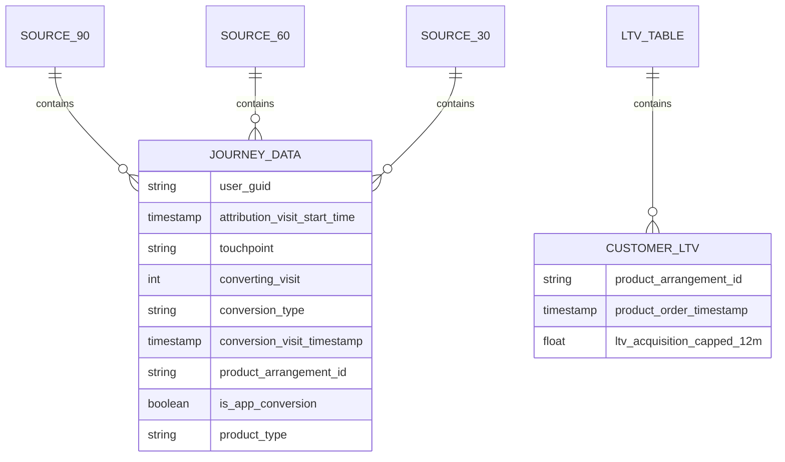

### 3. Data Cleaning & Preprocessing

**Location**: Lines 74-87 (pattern repeated throughout)

```python
# Preserve original conversion data
df["original_transaction"] = df["converting_visit"]

# Filter by conversion type
sub_df = df[df["conversion_type"] == "Subscription"].drop(columns=["conversion_type"])

# Mark final conversion in user journey
sub_df["user_max_date"] = sub_df.groupby(ids)["conversion_visit_timestamp"].transform("max")
sub_df[transaction] = 0
sub_df.loc[(sub_df[date] == sub_df["user_max_date"]) & 
           (sub_df["original_transaction"] == 1), transaction] = 1

# Sort for chronological journey analysis
sub_df = sub_df.sort_values([ids, date], ascending=[False, True])
sub_df["run_date"] = current_date.date()
```

**Data Transformation Logic:**

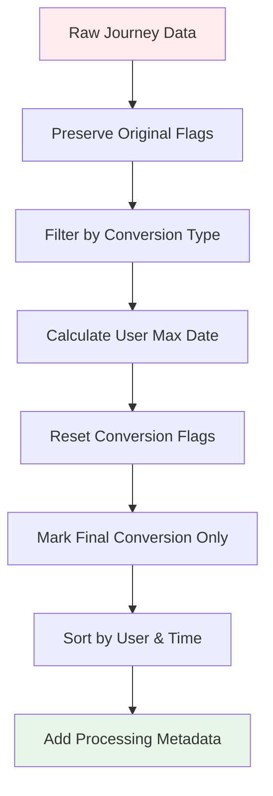

**Business Logic:**
- **Journey Integrity**: Ensures only the final touchpoint in a user's journey is marked as converting
- **Temporal Ordering**: Maintains chronological sequence for accurate attribution
- **Conversion Type Isolation**: Processes each business goal separately

### 4. Median Conversion Time Analysis

**Location**: Lines 88-129 (for conversion types with timing analysis)

```python
user_median_days = []

for user_guid, user_data in sub_df.groupby(ids):
    # Find first non-converting touchpoint (journey start)
    first_visit = user_data[user_data[transaction] == 0][date].min()
    
    # Find conversion touchpoint (journey end)
    conversion_date = user_data[user_data[transaction] == 1][date].min()
    
    # Calculate conversion velocity
    if pd.notnull(conversion_date) and pd.notnull(first_visit):
        days_to_convert = (conversion_date - first_visit).days
        user_median_days.append(days_to_convert)

# Calculate population median
median_days_to_subscribe = pd.Series(user_median_days).median()
```

**Conversion Velocity Analysis:**

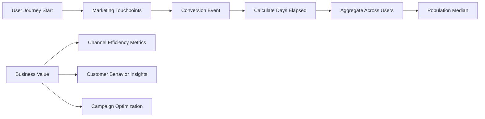

### 5. Attribution Model Engine

**Location**: Lines 132-158 (pattern repeated for each processing block)

```python
try:
    # Initialize Marketing Attribution Models
    attributions = MAM(
        sub_df,
        group_channels=True,                          # Enable channel grouping
        channels_colname=touchpoint,                  # Marketing channel column
        journey_with_conv_colname=transaction,        # Conversion flag column
        group_channels_by_id_list=[ids],             # User grouping column
        group_timestamp_colname=date,                # Timestamp for ordering
        create_journey_id_based_on_conversion=True,  # Generate unique journey IDs
    )
    
    # Apply all attribution models
    attributions.attribution_last_click()
    attributions.attribution_first_click()
    attributions.attribution_position_based(
        list_positions_first_middle_last=[0.3, 0.3, 0.4]  # First: 30%, Last: 40%, Middle: 30%
    )
    attributions.attribution_time_decay(
        decay_over_time=0.6,     # Decay rate
        frequency=7              # Hours between decay intervals
    )
    attribution_markov = attributions.attribution_markov(
        transition_to_same_state=False  # Prevent self-transitions
    )
```

**Attribution Model Comparison:**

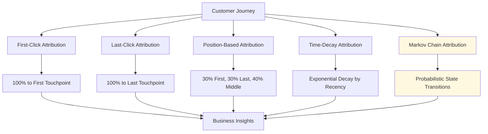

**Model Parameters:**
- **Position-Based Weights**: 30% first touch, 30% last touch, 40% middle touches
- **Time-Decay Rate**: 0.6 decay rate with 7-hour frequency intervals
- **Markov Configuration**: Absorbing states with no self-transitions

### 6. Results Processing & Data Enrichment

**Location**: Lines 160-198 (pattern repeated)

```python
# Extract user-level attribution results
user_df_temp = attributions.as_pd_dataframe()
user_df_temp["num_touchpoints"] = user_df_temp["channels_agg"].str.split(" > ").apply(len)
user_df_temp["run_date"] = current_date.date()

# Extract user GUID from journey ID
user_df_temp['user_guid'] = user_df_temp['journey_id'].str.extract(r'id:(.*)_J:0')[0]

# Enrich with product and conversion metadata
df['conversion_visit_timestamp_date'] = df['conversion_visit_timestamp'].dt.date
product_arrangement_df = df[df['conversion_type'] == 'Subscription'][[
    'user_guid',
    'conversion_visit_timestamp_date', 
    'product_arrangement_id',
    'is_app_conversion',        # Mobile app vs web conversion
    'product_type',             # Product category information
]].drop_duplicates()

# Merge attribution results with business metadata
user_df_temp = user_df_temp.merge(
    product_arrangement_df,
    left_on=['user_guid', 'run_date'],
    right_on=['user_guid', 'conversion_visit_timestamp_date'],
    how='left'
)
```

**Data Enrichment Flow:**

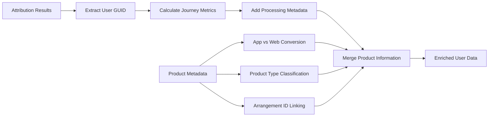

### 7. Markov Chain Transition Matrix Processing

**Location**: Lines 200-218 (pattern repeated)

```python
# Extract transition matrix from Markov results
markov_transition_matrix = attribution_markov[2].round(3)

# Standardize state names (Spanish to English)
markov_transition_matrix = markov_transition_matrix.rename(
    index=lambda x: x.replace("(inicio)", "(start)"),
    columns=lambda x: x.replace("(inicio)", "(start)"),
)

# Transform matrix to long format for analysis
markov_transition_matrix.reset_index(inplace=True)
markov_transition_matrix = pd.melt(
    markov_transition_matrix,
    id_vars="index",
    var_name="destination",
    value_name="probability",
)
markov_transition_matrix.columns = ["source", "destination", "probability"]
markov_transition_matrix["run_date"] = current_date.date()
```

**Markov State Diagram:**

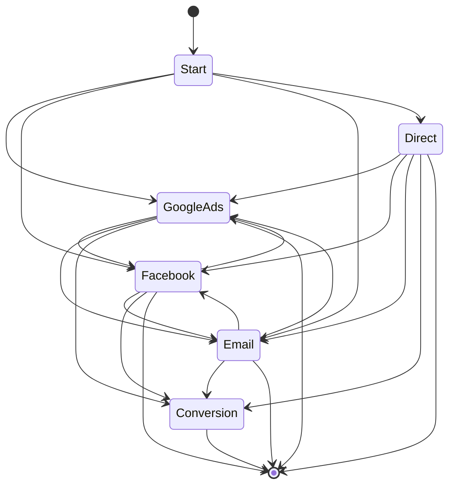

### 8. Removal Effect Analysis

**Location**: Lines 220-237 (pattern repeated)

```python
# Extract removal effects from Markov results
removal_effect_matrix = attribution_markov[3].round(3)
channels = removal_effect_matrix.index
removal_effect_values = removal_effect_matrix[["removal_effect"]]

# Normalize to percentages for business interpretation
normalized_values = (removal_effect_values / removal_effect_values.sum()) * 100
normalized_removal_effects = pd.DataFrame(
    normalized_values, index=channels, columns=["removal_effect"]
)

# Add metadata for analysis
normalized_removal_effects["run_date"] = current_date.date()
normalized_removal_effects["removal_effect_raw"] = removal_effect_values.values.flatten()
normalized_removal_effects.reset_index(inplace=True)
normalized_removal_effects.rename(columns={"index": "channel"}, inplace=True)
```

**Removal Effect Interpretation:**

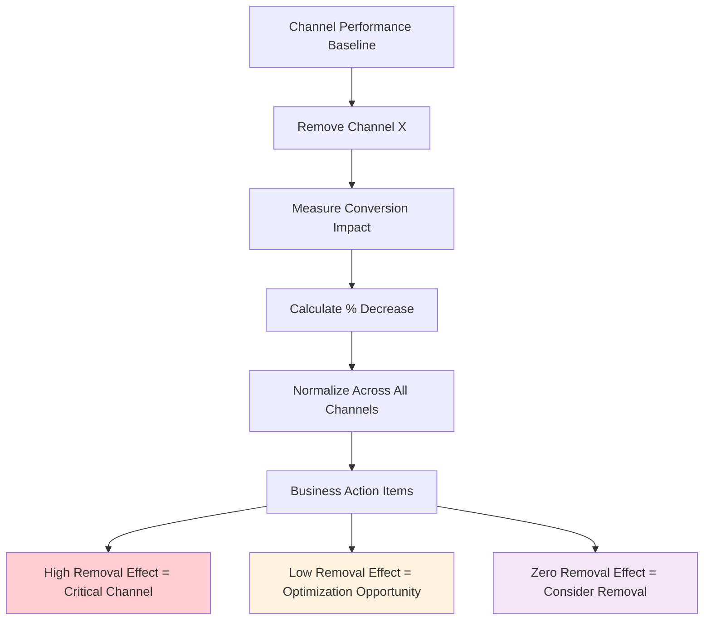

## Processing Pipeline Overview

### Multi-Dimensional Processing Matrix

The script processes data across **3 dimensions** creating **9 unique processing blocks**:

| Conversion Type | 90-Day Window | 60-Day Window | 30-Day Window |
|----------------|---------------|---------------|---------------|
| **Subscription** | ✅ Lines 45-268 | ✅ Lines 269-444 | ✅ Lines 445-620 |
| **Trial** | ✅ Lines 659-875 | ✅ Lines 876-1049 | ✅ Lines 1050-1227 |
| **Registration** | ✅ Lines 1261-1485 | ✅ Lines 1486-1709 | ✅ Lines 1710-1931 |

Each processing block follows the **identical pattern**:
1. **Table Selection** → **Data Extraction** → **Data Cleaning**
2. **Median Time Calculation** (for Subscription/Trial only)
3. **MAM Initialization** → **Attribution Models** → **Results Processing**
4. **Markov Analysis** → **Removal Effects** → **Channel Attribution**

### Data Aggregation & Merging

**Location**: Lines 621-658, 1228-1260, 1932-1954

```python
# Merge different lookback windows for each conversion type
suffixes = ['30', '60', '90']

# Subscription aggregation
attribution_dfs = [globals()[f'attribution_df_all_subs_{suffix}'] for suffix in suffixes]
attribution_df_all_subs = pd.concat(attribution_dfs, ignore_index=True)

# Repeat for removal effects, transition matrices, and user data
# Pattern repeated for Trial and Registration
```

**Final Aggregation Structure:**

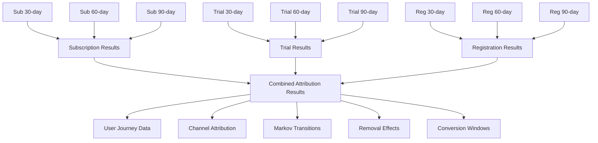

## LTV Integration & Business Value Calculation

**Location**: Lines 2004-2226

### LTV Data Processing

```python
# Load customer lifetime value data
ltv_table_id = "ft-customer-analytics.crg_nniu.ltv_last_15_days"
query = f"SELECT * FROM {ltv_table_id}"
ltv_df = query_job.to_dataframe()

# Clean and prepare LTV data
ltv_df = ltv_df.dropna(subset=["ltv_acquisition_capped_12m"])
group_columns = [col for col in ltv_df.columns if col != "ltv_acquisition_capped_12m"]
ltv_df = ltv_df.groupby(group_columns, as_index=False).agg(
    ltv_acquisition_capped_12m=("ltv_acquisition_capped_12m", "mean")
)
```

### Attribution-LTV Integration

```python
def calculate_removal_effect(row):
    """Calculate monetary impact of attribution by channel"""
    attr = row["attribution_markov_algorithmic"]  # Attribution scores
    ltv = row["ltv_acquisition_capped_12m"]      # Customer value
    channels = row["channels_agg"]                # Channel journey
    
    # Parse attribution scores and channels
    attr_parts = attr.split(">")
    channel_parts = channels.split(">") 
    
    # Calculate monetary impact per channel
    new_parts = []
    for channel, part in zip(channel_parts, attr_parts):
        channel = channel.strip()
        part = part.strip()
        val = float(part)
        multiplied_val = val * ltv  # Attribution score × LTV
        new_parts.append(f"{channel}: {multiplied_val}")
    
    return " > ".join(new_parts)
```

**LTV Integration Flow:**

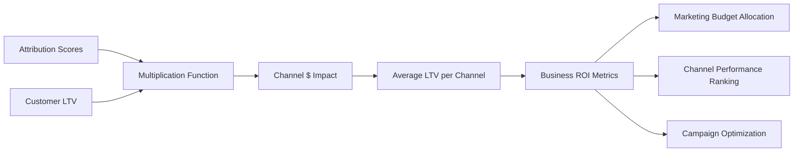

## Output Data Models

### 1. Attribution Results (`attribution_df_all`)

**Structure:**
```sql
channels_agg: STRING                    -- "Google Ads > Facebook > Email"
attribution_first_click: FLOAT          -- First-click attribution score
attribution_last_click: FLOAT           -- Last-click attribution score  
attribution_position_based: FLOAT       -- Position-based score
attribution_time_decay: FLOAT           -- Time-decay score
attribution_markov_algorithmic: FLOAT   -- Markov chain score
conversion_window: INTEGER              -- 30, 60, or 90 days
conversion_type: STRING                 -- "Subscription", "Trial", "Registration"
run_date: DATE                         -- Processing date
```

### 2. User Journey Data (`user_df_all`)

**Structure:**
```sql
journey_id: STRING                      -- Unique journey identifier
user_guid: STRING                       -- User identifier
channels_agg: STRING                    -- Complete channel journey
conversion_value: INTEGER               -- 1 for converted journeys
num_touchpoints: INTEGER                -- Number of touchpoints in journey
attribution_*: FLOAT                    -- Attribution scores for each model
ltv_acquisition_capped_12m: FLOAT      -- Customer lifetime value
product_arrangement_id: STRING          -- Product identifier
is_app_conversion: BOOLEAN              -- Mobile app conversion flag
product_type: STRING                    -- Product category
conversion_window: INTEGER              -- Attribution window
conversion_type: STRING                 -- Conversion type
run_date: DATE                         -- Processing date
```

### 3. Markov Transition Matrix (`markov_transition_matrix_all`)

**Structure:**
```sql
source: STRING                          -- Source channel or state
destination: STRING                     -- Destination channel or state  
probability: FLOAT                      -- Transition probability (0.0-1.0)
conversion_window: INTEGER              -- Attribution window
conversion_type: STRING                 -- Conversion type
run_date: DATE                         -- Processing date
```

### 4. Removal Effects (`normalized_removal_effects_all`)

**Structure:**
```sql
channel: STRING                         -- Marketing channel name
removal_effect: FLOAT                   -- Normalized removal effect (%)
removal_effect_raw: FLOAT              -- Raw removal effect value
average_ltv: FLOAT                      -- Average LTV impact per channel
conversion_window: INTEGER              -- Attribution window
conversion_type: STRING                 -- Conversion type  
run_date: DATE                         -- Processing date
```

### 5. Conversion Window Analysis (`conversion_window_df`)

**Structure:**
```sql
stage: STRING                           -- "subscriber", "trial", "registration"
median_days: FLOAT                      -- Median days to conversion
run_date: DATE                         -- Processing date
```

## BigQuery Upload Strategy

**Location**: Lines 2227-2299

### Data Upload Configuration

```python
# Configure BigQuery load job
job_config = bigquery.LoadJobConfig(
    write_disposition=bigquery.WriteDisposition.WRITE_APPEND,
    source_format=bigquery.SourceFormat.PARQUET,        # Optimized format
    autodetect=True,                                     # Schema auto-detection
    time_partitioning=bigquery.TimePartitioning(
        type_=bigquery.TimePartitioningType.DAY, 
        field="run_date"                                 # Partition by processing date
    ),
)

# Define output tables
dataframes = {
    "ft-customer-analytics.crg_nniu_attribution.attribution_markov_transition_matrix_all_test": markov_transition_matrix_all,
    "ft-customer-analytics.crg_nniu_attribution.attribution_normalized_removal_effects_all_test": normalized_removal_effects_all,
    "ft-customer-analytics.crg_nniu_attribution.attribution_user_df_all_test": user_df_all,
    "ft-customer-analytics.crg_nniu_attribution.attribution_df_all_test": attribution_df_all,
    "ft-customer-analytics.crg_nniu_attribution.attribution_conversion_window_df_test": conversion_window_df
}
```

### Upsert Strategy

```python
for destination_table, dataframe in dataframes.items():
    # Extract processing dates
    run_dates = dataframe['run_date'].unique()
    
    # Delete existing data for these dates (prevents duplicates)
    for run_date in run_dates:
        query = f"""
            DELETE FROM `{destination_table}`
            WHERE run_date = DATE('{run_date}')
        """
        delete_job = client.query(query)
        delete_job.result()
    
    # Load new data
    load_job = client.load_table_from_dataframe(
        dataframe.reset_index(drop=True), 
        destination_table, 
        job_config=job_config
    )
    load_job.result()
```

**Upload Strategy Benefits:**
- **Partition Management**: Efficient query performance through date partitioning
- **Upsert Logic**: Prevents duplicate data while allowing reprocessing
- **Error Isolation**: Failed uploads don't affect other tables
- **Schema Evolution**: Auto-detection supports schema changes


## Error Handling & Resilience

### Exception Management

```python
try:
    # Attribution processing
    attributions = MAM(sub_df, ...)
    # Process results
except Exception as e:
    print(f"An error occurred for the date {current_date.strftime('%Y-%m-%d')}: {e}")
    continue  # Skip to next day, don't crash entire pipeline
```

**Resilience Features:**
- **Day-Level Isolation**: Failed days don't affect other processing
- **Comprehensive Logging**: Detailed error messages with context
- **Graceful Degradation**: Continues processing despite individual failures

### Data Quality Checks

- **Empty Dataset Handling**: Skips days with no data
- **Schema Validation**: Automatic column presence verification
- **Null Value Management**: Proper handling of missing attribution data


---

This comprehensive documentation provides a complete technical understanding of the `main2.py` attribution pipeline, enabling effective deployment, maintenance, and business utilization of the marketing attribution system.