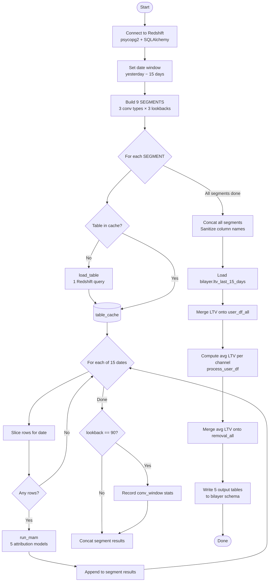
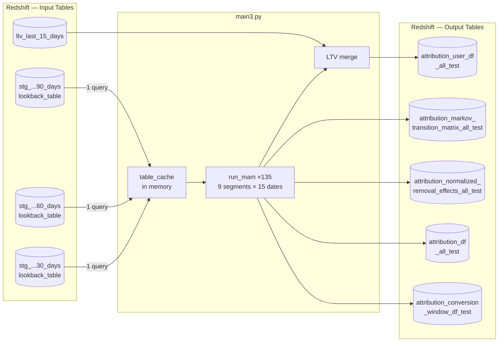
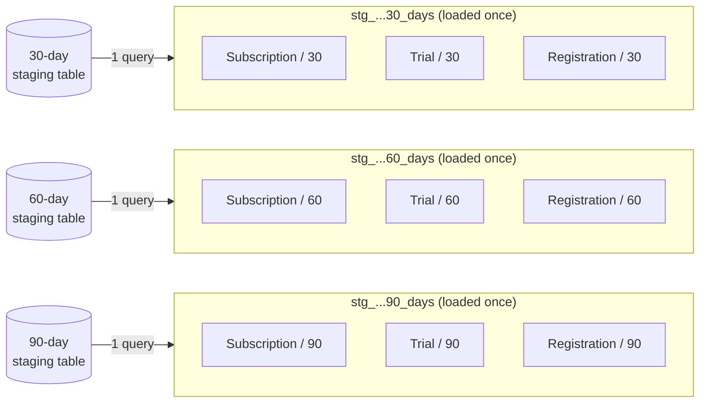
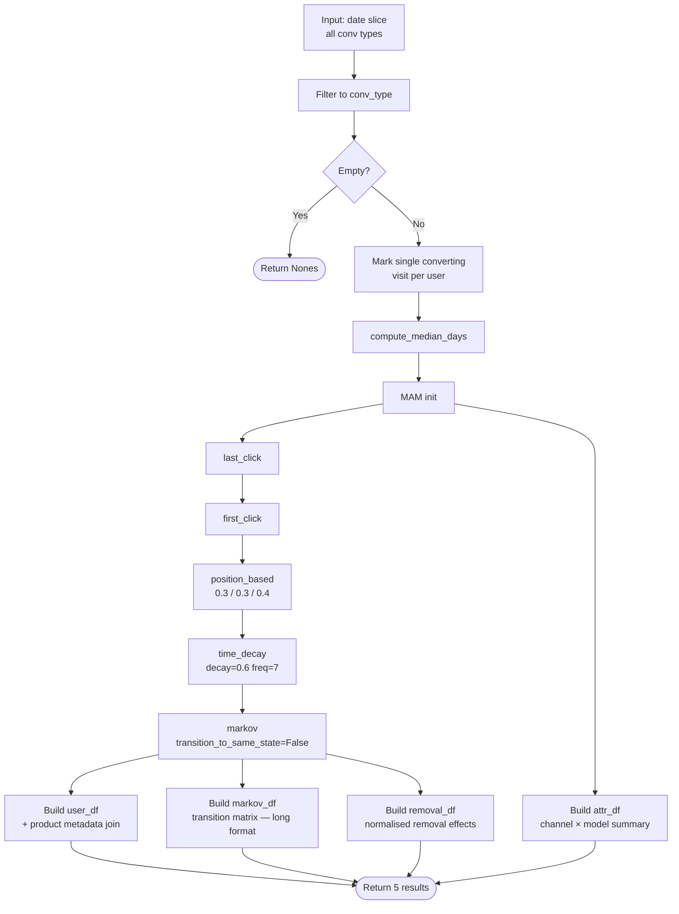
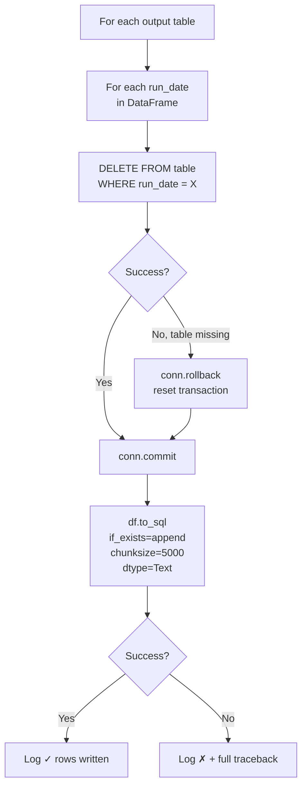

# Attribution Pipeline — Technical Documentation

**File:** `main3.py` (deployed as `main3.ipynb` via jupytext)  
**Deployed on:** Posit Connect  
**Python version:** 3.9  

---

## Table of Contents

1. [Overview](#overview)
2. [Architecture and Execution Flow](#architecture-and-execution-flow)
3. [Environment Variables and Configuration](#environment-variables-and-configuration)
4. [Input Tables](#input-tables)
5. [SEGMENTS Configuration](#segments-configuration)
6. [Helper Functions](#helper-functions)
7. [Attribution Models](#attribution-models)
8. [Output Tables](#output-tables)
9. [Write Strategy](#write-strategy)
10. [Performance Notes](#performance-notes)
11. [Known Issues and Gotchas](#known-issues-and-gotchas)
12. [Dependencies](#dependencies)

---

## Overview

This pipeline computes multi-touch marketing attribution for FT subscription conversions. Each daily run processes the most recent 15 days of user journey data (touchpoint sequences leading to a conversion) across three conversion types (Subscription, Trial, Registration) and three lookback windows (30, 60, 90 days), for a total of 9 segment combinations.

For each segment × date combination, the pipeline runs five attribution models via the `marketing_attribution_models` (MAM) library, writes per-user attribution to Redshift, and augments results with 12-month capped LTV data to produce channel-level LTV estimates.

---

## Architecture and Execution Flow



The two key structural decisions that drive performance are the **table cache** (each staging table loaded once, reused across conv types sharing that lookback) and the **batched date load** (all 15 days fetched in one query per staging table, then filtered in-memory per date).

---

## Environment Variables and Configuration

### Redshift Connection

| Variable | Default | Description |
|---|---|---|
| `REDSHIFT_HOST` | `redshift.dw.in.ft.com` | Redshift cluster hostname |
| `REDSHIFT_PORT` | `5439` | Redshift port |
| `REDSHIFT_DB` | `prod` | Database name |
| `REDSHIFT_USER` | *(required)* | DB username — no default |
| `REDSHIFT_PASSWORD` | *(required)* | DB password — no default |

`REDSHIFT_USER` and `REDSHIFT_PASSWORD` have no defaults and will cause a connection error at startup if unset.

Two connection objects are created at module level:

- `conn` — a raw `psycopg2` connection, used for `DELETE` statements and transaction management during the write phase.
- `engine` — a SQLAlchemy engine (`postgresql+psycopg2://`), used for `pd.read_sql` reads and `df.to_sql` writes.

### Date Window

Computed at startup (not parameterised):

```python
end_date   = yesterday
start_date = yesterday − 14 days   # gives a 15-day inclusive window
```

Both are `datetime.date` objects.

### Column Name Constants

| Constant | Value | Role |
|---|---|---|
| `IDS` | `"user_guid"` | User identifier |
| `DATE_COL` | `"attribution_visit_start_time"` | Timestamp of each touchpoint visit |
| `TOUCHPOINT` | `"touchpoint"` | Marketing channel name |
| `TRANSACTION` | `"converting_visit"` | Binary flag: 1 = converting visit |

---

## Input Tables



### Staging Tables — `bilayer.stg_conversion_users_last_15_days_{N}_days_lookback_table`

Three tables, one per lookback window (`N` ∈ {30, 60, 90}). Each table is a pre-built snapshot containing all touchpoints for users who converted within the last 15 days, with journey history going back N days prior to conversion. These tables must be refreshed externally before the pipeline runs (see [Known Issues](#known-issues-and-gotchas)).

**Columns used by the pipeline:**

| Column | Type | Description |
|---|---|---|
| `user_guid` | varchar | Unique user identifier |
| `attribution_visit_start_time` | timestamp | Timestamp of the touchpoint visit |
| `touchpoint` | varchar | Marketing channel (e.g. `SEO`, `Paid Search`) |
| `converting_visit` | int (0/1) | 1 if this visit is the conversion visit |
| `conversion_visit_timestamp` | timestamp | Timestamp of the user's conversion event |
| `conversion_type` | varchar | `"Subscription"`, `"Trial"`, or `"registration"` |
| `product_arrangement_id` | varchar/int | Links to LTV table |
| `is_app_conversion` | bool/int | Whether the conversion was via app |
| `product_type` | varchar | Product variant |
| `user_registration_source` | varchar | Registration origin |

The pipeline queries only rows where `conversion_visit_timestamp::DATE` falls within the 15-day window. All 15 days are fetched in a single query and held in memory; date filtering for each MAM call is done in-process.

### LTV Table — `bilayer.ltv_last_15_days`

Contains 12-month capped LTV estimates per product arrangement.

**Columns used:**

| Column | Type | Description |
|---|---|---|
| `product_arrangement_id` | varchar/int | Join key to user_df_all |
| `product_order_timestamp` | timestamp | Date of the order (cast to `.date` for join) |
| `ltv_acquisition_capped_12m` | float | 12-month LTV cap (rows with null are dropped before join) |

Duplicate `(product_arrangement_id, product_order_timestamp)` combinations are resolved by averaging `ltv_acquisition_capped_12m`.

---

## SEGMENTS Configuration

```python
SEGMENTS = [
    (conv_type_filter, output_label, stage_name, lookback_days),
    ...
]
```

Each tuple defines one segment:

| Field | Description |
|---|---|
| `conv_type_filter` | String matched against the `conversion_type` column in the staging table. Case-sensitive: `"Subscription"`, `"Trial"`, `"registration"` (lowercase r). |
| `output_label` | Label written to `conversion_type` column in all output tables. `"Registration"` (capital R) used for output even though the filter is lowercase. |
| `stage_name` | Short slug used in `conv_window_records` (`"subscriber"`, `"trial"`, `"registration"`). |
| `lookback_days` | Determines which staging table to load (30, 60, or 90). |

The list is ordered so all three conversion types appear consecutively for each lookback window. This ensures the table cache hit rate is 2-out-of-3 per staging table: the first conv type for a given lookback triggers the load, and the next two reuse the cached DataFrame.



---

## Helper Functions

### `_ts(msg)`

**Purpose:** Timestamped progress logging.

Writes `[HH:MM:SS] msg\n` directly to `sys.__stdout__` (bypassing any Jupyter output capture). The explicit flush ensures log lines appear immediately in Posit Connect run logs.

---

### `load_table(table_id) → pd.DataFrame`

**Purpose:** Fetches all rows for the 15-day window from a staging table and builds the `channels_agg` journey string.

**Parameters:**

| Param | Type | Description |
|---|---|---|
| `table_id` | str | Fully qualified table name, e.g. `bilayer.stg_conversion_users_last_15_days_30_days_lookback_table` |

**Logic:**

1. Runs a single `SELECT *` with a `conversion_visit_timestamp::DATE` range filter.
2. Sorts by `(user_guid, conversion_visit_timestamp, attribution_visit_start_time)` to ensure touchpoints are ordered chronologically within each journey.
3. Groups by `(user_guid, conversion_visit_timestamp)`, joins all `touchpoint` values with `" > "` to produce `channels_agg` (the journey string MAM expects).
4. Merges `channels_agg` back onto the full row-level DataFrame and returns it.

**Returns:** `pd.DataFrame` with all original columns plus `channels_agg`.

**Side effect:** Result is stored in `table_cache[table_id]` by the calling loop.

---

### `compute_median_days(filtered_df) → float | None`

**Purpose:** Calculates the median number of days between a user's first non-converting touchpoint and their conversion visit. Used to populate `attribution_conversion_window_df_test`.

**Parameters:**

| Param | Type | Description |
|---|---|---|
| `filtered_df` | pd.DataFrame | Rows for a single conv_type, already filtered, as prepared inside `run_mam` |

**Logic:**

For each user:
- Find the earliest visit where `converting_visit == 0` (first non-converting touchpoint).
- Find the earliest visit where `converting_visit == 1` (converting visit).
- Compute `(conversion_date − first_visit_date).days`.

Returns `pd.Series(days).median()`, or `None` if no valid pairs are found.

---

### `run_mam(df, current_date, conv_type) → tuple`

**Purpose:** Core attribution function. Runs all five MAM models against a single day's data slice for one conversion type.

**Parameters:**

| Param | Type | Description |
|---|---|---|
| `df` | pd.DataFrame | All rows for the current date (all conv types, not yet filtered) |
| `current_date` | pd.Timestamp | The date being processed |
| `conv_type` | str | Conversion type filter string (e.g. `"Subscription"`) |

**Logic:**

1. Copies the input DataFrame and snapshots `converting_visit` into `original_transaction`.
2. Filters to rows where `conversion_type == conv_type`. Returns `(None, None, None, None, None)` if empty.
3. **Single converting visit per user:** Sets all `converting_visit` flags to 0, then sets it back to 1 only for the row where `attribution_visit_start_time == max(conversion_visit_timestamp)` AND the original flag was 1. This ensures each user has exactly one marked conversion (their most recent), preventing MAM from treating earlier conversions as noise.
4. Calls `compute_median_days`.
5. Initialises `MAM` with `group_channels=True`, `create_journey_id_based_on_conversion=True`.
6. Runs five attribution models sequentially (see [Attribution Models](#attribution-models)).
7. Builds four result DataFrames:

   - **`user_df`** — from `attributions.as_pd_dataframe()`. Adds `num_touchpoints`, `run_date`, extracts `user_guid` from MAM's `journey_id` (`id:{user_guid}_J:0`). Merges product metadata (`product_arrangement_id`, `is_app_conversion`, `product_type`, `user_registration_source`) from the original unfiltered slice, joined on `(user_guid, run_date)`.

   - **`markov_df`** — the Markov transition matrix (`markov_result[2]`), melted to long format with columns `source`, `destination`, `probability`. State label `(inicio)` is renamed to `(start)` for readability.

   - **`removal_df`** — from `markov_result[3]`. Raw removal effects are normalised to sum to 100% and stored alongside the raw values. Columns: `channel`, `removal_effect` (%), `removal_effect_raw`, `run_date`.

   - **`attr_df`** — from `attributions.group_by_channels_models`. Contains per-channel attribution totals for all five models. Column names are cleaned (dots and spaces → underscores).



**Returns:** `(user_df, markov_df, removal_df, attr_df, median_days)`

On exception: logs the traceback and returns `(None, None, None, None, median_days)` — median_days is still returned because it is computed before the MAM call.

---

### `sanitize_col(col) → str`

**Purpose:** Cleans column names that MAM generates with decimal notation.

**Logic:**

MAM creates columns like `attr_0.3_position_based` and `attr_0.6_time_decay`. These names are invalid or awkward in SQL.

1. Strips `_0.3`, `0.3`, etc. using `re.sub(r"(_)?\d+\.\d+", "", col)`.
2. Collapses consecutive underscores: `re.sub(r"_+", "_", col)`.
3. Strips leading/trailing underscores.

Applied to all columns of `user_df_all` after concatenation.

---

### `calculate_removal_effect(row) → str | float`

**Purpose:** Computes per-channel LTV contribution for a single user row by multiplying each touchpoint's Markov attribution share by the user's LTV.

**Input:** A single row from `user_df_all` containing:
- `attribution_markov_algorithmic` — a `" > "`-delimited string of Markov attribution weights per touchpoint.
- `ltv_acquisition_capped_12m` — the user's LTV value.
- `channels_agg` — a `" > "`-delimited string of channel names.

**Logic:**

1. Returns `np.nan` if any of the three fields is null.
2. Splits `attribution_markov_algorithmic` and `channels_agg` on `" > "`. Returns `np.nan` if the part counts differ.
3. For each `(channel, weight)` pair, computes `weight * ltv` and formats as `"channel_name: value"`.
4. Joins all pairs with `" > "`.

**Returns:** String like `"Google: 45.2 > Facebook: 12.1"`, or `np.nan` on any failure.

---

### `process_user_df(user_df) → pd.DataFrame`

**Purpose:** Converts the `removal_effect_ltv` strings into a tidy channel × run_date average LTV table.

**Logic:**

1. Applies `calculate_removal_effect` row-wise to build `removal_effect_ltv`.
2. Drops rows where `removal_effect_ltv` is null.
3. Explodes the `" > "`-delimited string so each `"channel: value"` pair becomes its own row.
4. Splits on `": "` to produce `channel` and `ltv` columns.
5. Groups by `(channel, run_date)` and computes mean LTV.

**Returns:** `pd.DataFrame` with columns `channel`, `run_date`, `average_ltv`.

---

## Attribution Models

All models are run via the `marketing_attribution_models.MAM` library. The pipeline uses these settings globally:

- `group_channels=True` — touchpoints are grouped into journeys per user
- `create_journey_id_based_on_conversion=True` — a new journey is started after each conversion event

### Last Click

```python
attributions.attribution_last_click()
```

Assigns 100% of the conversion credit to the final touchpoint in the journey. Simple, over-rewards bottom-of-funnel channels (e.g. Brand Search).

### First Click

```python
attributions.attribution_first_click()
```

Assigns 100% of the conversion credit to the first touchpoint. Over-rewards awareness channels.

### Position-Based (U-shaped)

```python
attributions.attribution_position_based(list_positions_first_middle_last=[0.3, 0.3, 0.4])
```

- First touchpoint: 30%
- Last touchpoint: 40%
- All middle touchpoints: share the remaining 30% equally

Weights both acquisition and closing channels while still crediting mid-journey touches.

### Time Decay

```python
attributions.attribution_time_decay(decay_over_time=0.6, frequency=7)
```

Credit decays exponentially the further a touchpoint is from the conversion. `decay_over_time=0.6` means a touchpoint 7 days before conversion receives 60% of the credit of a touchpoint at the conversion date. Appropriate when recency is considered a meaningful signal.

### Markov Chain (Algorithmic)

```python
attributions.attribution_markov(transition_to_same_state=False)
```

Builds a transition probability matrix across all channel states. Computes **removal effects**: the drop in conversion probability when a channel is completely removed from all journeys. This is the only data-driven, path-aware model in the set.

`transition_to_same_state=False` prevents self-loops in the transition matrix (a user visiting the same channel consecutively does not count as a transition to itself).

The Markov model is the slowest step. It returns three objects; the pipeline uses:
- `markov_result[2]` — the transition probability matrix (square, channels × channels)
- `markov_result[3]` — the removal effects (one value per channel)

---

## Output Tables

All tables are written to the `bilayer` schema. Table names currently have an `_all_test` or `_test` suffix — this is a legacy naming convention from development; they are the production tables.

---

### `bilayer.attribution_markov_transition_matrix_all_test`

The Markov state transition matrix in long (melted) format, after filtering out zero-probability transitions.

| Column | Type | Description |
|---|---|---|
| `source` | text | Origin channel state (including `(start)` and `(conversion)`) |
| `destination` | text | Destination channel state |
| `probability` | float | Transition probability (0–1, rounded to 3 dp), > 0 only |
| `run_date` | date | Date the attribution was computed for |
| `conversion_window` | int | Lookback window in days (30, 60, 90) |
| `conversion_type` | text | `"Subscription"`, `"Trial"`, `"Registration"` |

---

### `bilayer.attribution_normalized_removal_effects_all_test`

Markov removal effects per channel, normalised to sum to 100% within each run_date × segment, augmented with average LTV per channel.

| Column | Type | Description |
|---|---|---|
| `channel` | text | Marketing channel name |
| `removal_effect` | float | Normalised removal effect (%, sums to 100 within group) |
| `removal_effect_raw` | float | Raw removal effect before normalisation (rounded to 3 dp) |
| `run_date` | date | Date the attribution was computed for |
| `conversion_window` | int | Lookback window in days |
| `conversion_type` | text | Conversion type label |
| `average_ltv` | float | Mean LTV attributed to this channel via Markov weights (from `process_user_df`) |

Rows where `removal_effect == 0` are excluded before writing.

---

### `bilayer.attribution_user_df_all_test`

User-level attribution output — one row per user per run_date per segment. The widest and most detailed table.

| Column | Type | Description |
|---|---|---|
| `journey_id` | text | MAM-generated ID: `id:{user_guid}_J:0` |
| `user_guid` | text | Extracted user identifier |
| `channels_agg` | text | Full journey string: `"ch1 > ch2 > ch3"` |
| `num_touchpoints` | int | Number of touchpoints in the journey |
| `run_date` | date | Date of the conversion |
| `product_arrangement_id` | text/int | Product arrangement identifier (0 if null) |
| `is_app_conversion` | bool/int | Whether conversion was via app |
| `product_type` | text | Product variant |
| `user_registration_source` | text | Registration origin |
| `conversion_window` | int | Lookback window in days |
| `conversion_type` | text | Conversion type label |
| `ltv_acquisition_capped_12m` | float | 12-month capped LTV (from LTV table merge) |
| `attr_last_click_*` | float | Per-channel last-click attribution weights |
| `attr_first_click_*` | float | Per-channel first-click attribution weights |
| `attr_position_based_*` | float | Per-channel position-based weights (after sanitize_col) |
| `attr_time_decay_*` | float | Per-channel time-decay weights (after sanitize_col) |
| `attr_markov_algorithmic_*` | float | Per-channel Markov attribution weights |

The exact set of `attr_*` columns is dynamic, determined by the channels present in the data. All object-typed columns are written as `TEXT`.

---

### `bilayer.attribution_df_all_test`

Channel × model summary — aggregated attribution totals, not user-level.

| Column | Type | Description |
|---|---|---|
| `channel_name` | text | Marketing channel |
| `attr_last_click` | float | Total last-click attribution for this channel |
| `attr_first_click` | float | Total first-click attribution |
| `attr_position_based` | float | Total position-based attribution (after sanitize_col) |
| `attr_time_decay` | float | Total time-decay attribution (after sanitize_col) |
| `attr_markov_algorithmic` | float | Total Markov attribution |
| `run_date` | date | Date the attribution was computed for |
| `conversion_window` | int | Lookback window in days |
| `conversion_type` | text | Conversion type label |

This table is the primary source for channel-level reporting dashboards.

---

### `bilayer.attribution_conversion_window_df_test`

Median days-to-conversion per stage per date. Only populated from the 90-day lookback run.

| Column | Type | Description |
|---|---|---|
| `stage` | text | Stage slug: `"subscriber"`, `"trial"`, `"registration"` |
| `median_days` | float | Median days from first non-converting visit to conversion |
| `run_date` | date | Date the conversion occurred |

One record per `(stage, run_date)` combination, up to 45 records per run (3 stages × 15 dates).

---

## Write Strategy

### Delete + Append Pattern



For each output table and each distinct `run_date` in the DataFrame:

```sql
DELETE FROM bilayer.{table_name} WHERE run_date = '{run_date}';
```

After all deletes succeed, `conn.commit()` is called once. Then `df.to_sql(..., if_exists="append")` inserts the new rows.

**Why not TRUNCATE or full replace?**

- The pipeline writes 15 days at a time. Using `if_exists="replace"` would drop and recreate the entire table on every run, destroying historical data outside the current window.
- Idempotency: re-running the pipeline for the same date window does not duplicate rows, because each `run_date` is deleted before re-inserting.

**Rollback on missing table:**

If the table does not yet exist, `DELETE` will raise an exception. The pipeline catches this and calls `conn.rollback()` to clear the aborted transaction state (required by PostgreSQL/Redshift) before proceeding. The subsequent `to_sql` with `if_exists="append"` will create the table automatically on first run.

### `to_sql` Parameters

```python
df.to_sql(
    table_name, engine, schema="bilayer",
    if_exists="append", index=False,
    chunksize=5000, method="multi",
    dtype={col: Text() for col in object_columns}
)
```

- `chunksize=5000` — avoids Redshift parameter limit errors on wide DataFrames.
- `method="multi"` — uses multi-row `INSERT` statements for significantly better throughput than single-row inserts.
- `dtype=Text()` for all `object` columns — prevents SQLAlchemy from inferring `VARCHAR(n)` with a length cap that may be too short for journey strings.

---

## Performance Notes

### 3 Redshift queries vs 135

Without the table cache, the naive approach would be:
- 9 segments × 15 dates = 135 separate Redshift queries.

The actual approach:
- 3 queries (one per lookback window), all data loaded into memory.
- Date slicing and conv_type filtering are done in pandas in-process.

This reduces Redshift round trips from 135 to 3 and eliminates the network overhead of 132 redundant connections and result fetches.

### Table Cache

```python
table_cache = {}
if table_id not in table_cache:
    table_cache[table_id] = load_table(table_id)
df_all = table_cache[table_id]
```

Each staging table is held in memory for the lifetime of the run. The SEGMENTS list is ordered so all three conv types share each lookback consecutively, maximising cache hits. Memory footprint is three DataFrames, typically in the low hundreds of MB each.

### Zero-Probability Filter on Markov Matrix

The full Markov transition matrix is dense: every channel-pair combination has an entry, including the many with probability 0. These zeros are meaningless and typically dominate row count.

```python
markov_all = markov_all[markov_all["probability"] > 0]
```

Applied immediately before writing. Reduces table size by an order of magnitude with no information loss.

### Markov as Bottleneck

The Markov chain computation (`attribution_markov`) is the slowest step in each `run_mam` call. It involves matrix operations over all unique channel sequences. On large date slices (high-conversion dates), this step can take several minutes. The `_ts` logger prints timing breadcrumbs at each model step to make this visible in run logs.

---

## Known Issues and Gotchas

### Staging tables must be refreshed externally before each run

The pipeline reads `bilayer.stg_conversion_users_last_15_days_{N}_days_lookback_table` as static snapshots. These tables are **not** rebuilt inside this notebook — they are managed by a separate upstream process. If the upstream refresh has not run, the pipeline will compute attribution on stale data without raising an error.

### `attribution_user_df_all_test` requires TEXT columns

The `channels_agg` journey string for users with long or complex paths can exceed the length of any `VARCHAR(n)` that SQLAlchemy might infer. The pipeline explicitly sets `dtype=Text()` for all `object`-typed columns to avoid truncation errors. If the table schema is ever manually altered (e.g. columns changed to `VARCHAR(256)`), subsequent inserts will fail for long journey strings.

### `conv_window_records` only populated for 90-day lookback

The conversion window median stats are written once per stage per date, sourced from the 90-day run. The 30-day and 60-day runs silently skip this collection. This is intentional (one canonical median per date), but means the 90-day segment **must** run for `attribution_conversion_window_df_test` to be populated at all.

### `conversion_type` case inconsistency

In the staging tables, the registration conversion type is stored as lowercase `"registration"`. The SEGMENTS filter uses lowercase to match the DB value, but the output label is titlecase `"Registration"`. This mismatch is handled explicitly in the SEGMENTS tuples and is not a bug, but any query that filters by `conversion_type` in the output tables must use titlecase `"Registration"`.

### `product_arrangement_id` null-filling

Rows without a `product_arrangement_id` are filled with `0` before the LTV merge. This means all null-arrangement users are grouped under the artificial key `0`, and if the LTV table happens to contain a row with `product_arrangement_id = 0`, those users will erroneously receive LTV values.

### SQLAlchemy version constraint

The pipeline requires `sqlalchemy>=1.4,<2`. SQLAlchemy 2.x introduced breaking changes to the `to_sql` interface and connection handling that are incompatible with this codebase. Upgrading beyond `1.x` will break the write phase.

### Posit Connect / jupytext deployment

The source file is `main3.py` using jupytext percent-format cells (`# %%`). Posit Connect executes the `.ipynb` version converted from this source. Any edits must be made in `main3.py` and the notebook regenerated before redeployment. The `_ts` logger writes to `sys.__stdout__` specifically to bypass Jupyter's output capture and ensure log lines reach Posit Connect's run log viewer.

### Single psycopg2 connection for writes

The `conn` object is created at module start and kept open for the entire run. On a long run (multiple hours), idle connection timeouts on the Redshift side can cause the delete phase to fail with a closed-connection error. If this occurs, the fix is to either reduce run time or recreate the connection immediately before the write loop.

---

## Dependencies

| Package | Version constraint | Purpose |
|---|---|---|
| `pandas` | `==1.3.3` | DataFrame operations |
| `numpy` | `<2` | Numerical operations |
| `psycopg2-binary` | latest | Raw Redshift connection |
| `sqlalchemy` | `>=1.4,<2` | ORM engine for `read_sql` / `to_sql` |
| `marketing-attribution-models` | latest | MAM attribution library |

Pinned `pandas==1.3.3` is required for compatibility with the `marketing-attribution-models` library internals. Upgrading pandas without verifying MAM compatibility may break the `as_pd_dataframe()` call or journey grouping logic.
